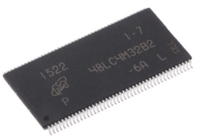

# SDRAM Controller 

This repository contains a Micron 128Mb (**MT48LC4M32B2**) SDRAM controller written in VHDL. This is a relative small device (16MByte) which you may find on some old FPGA development boards. I wrote the code back in 2007 and although the design is somewhat outdated somebody might still find some use for it. 

I have made some minor VHDL2008 changes and checked it against a modern Modelsim version.

The processor side to the SDRAM controller is a basic SRAM interface modeled on a 8086/186 processor (*see procedures wrmem/rdmem in sdram_ctrl_tester.vhd*). A typical 8086/186 memory cycle starts by asserting the **ALE** (Address Latch Enable) signal which indicates the address is valid and can be latched followed by an active low **RDN** or active low write **WRN** strobe. The cycle is terminated with the **READY** signal is asserted.

The SDRAM [**MT48LC4M32B2**](https://www.micron.com/products/dram/sdram/part-catalog/mt48lc4m32b2b5-6a) memory model is provided by Micron. Note this is (as usual) a Verilog behavioral model and hence you need a mixed language simulator.

The testbench executes 3 tests:
1) A read/write test to the same row
2) A read/write test to a different bank/row
3) A random read/write pattern test

If no errors are detected a **test passed** messages is returned.

## Requirements
1) Dual language Modelsim/Questa or any other mixed language simulator will do.

## Check before building
1) Make sure the Modelsim/Questa win64pe/win64 directory is in your search path.

## Simulation

To run the simulation under Windows simple execute the **run.bat** file in a CMD prompt.

The output should be something like:

```
E:\SDRAM-Controller>run.bat
Check if work library exists
Compile VHDL SDRAM Controller
Compile Micron Verilog Memory model
Compile VHDL testbench
Run simulation
# vsim -quiet -batch -t ps work.sdram_ctrl_tb -do "nolog -r /*; run -all; quit -f"
# Start time: 19:21:54 on Nov 03,2022
# ** Note: (vsim-3813) Design is being optimized due to module recompilation...
# //  Questa Sim-64
# //  Version 2022.3 win64 Jul 18 2022
# //
# //  Copyright 1991-2022 Mentor Graphics Corporation
# //  All Rights Reserved.
# //
# //  QuestaSim and its associated documentation contain trade
# //  secrets and commercial or financial information that are the property of
# //  Mentor Graphics Corporation and are privileged, confidential,
# //  and exempt from disclosure under the Freedom of Information Act,
# //  5 U.S.C. Section 552. Furthermore, this information
# //  is prohibited from disclosure under the Trade Secrets Act,
# //  18 U.S.C. Section 1905.
# //
#
# nolog -r /*
# run -all
# ------- Read/Write to the same row --------
# ------- Read/Write to a different row/bank --------
# ------- Random R/W --------
# ------- Write Pattern to memory--------
# ------- Read Pattern from memory--------
# ** Note: -------------Test Passed -----------
#    Time: 118296263 ns  Iteration: 1  Instance: /sdram_ctrl_tb/TST
# Break in Process line__90 at testbench/sdram_ctrl_tester.vhd line 381
# Stopped at testbench/sdram_ctrl_tester.vhd line 381
# quit -f
# End time: 19:22:39 on Nov 03,2022, Elapsed time: 0:00:45
# Errors: 0, Warnings: 0
```


## License

This project is licensed under the MIT License - see the LICENSE file for details

## Notice
ModelSim®, Questa, QuestaSim and their respective logos are trademarks or registered trademarks of Siemens Industry Software Limited.
All other trademarks are the property of their respective owners.